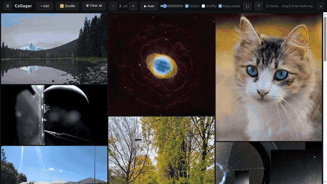

# Collager

A desktop media collage viewer for Linux and Windows. Drop in images
(PNG/JPEG/WebP), GIFs and videos (MP4/WebM) and see them all together as one
scrollable, tightly packed collage. GIFs and videos loop forever; videos are
muted.



<sub>Demo media: public-domain images and video from the NASA image library, plus CC0
photos from Wikimedia Commons.</sub>

## Run

Requires [pnpm](https://pnpm.io/installation).

```bash
pnpm install
pnpm start
```

Electron downloads its binary on first run, so the first `pnpm start` takes a
while.

After three graphics-process crashes the app restarts with hardware acceleration off and
stays that way. `collager --gpu` turns it back on; `--no-gpu` turns it off for one run.

Installers:

```bash
pnpm dist:linux   # AppImage
pnpm dist:win     # NSIS installer (run on Windows, or via wine)
```

## Usage

- **Add media**: drag and drop files or folders anywhere in the window (folders
  are scanned recursively), or use the **+ Add** button. Duplicate content is
  detected by file hash, whatever the file name.
- **Remove**: hover a tile and click the ✕.
- **Reorder**: drag a tile onto another tile to move it there. The order
  persists and is what shuffle randomizes.
- **Shuffle**: the 🔀 button re-shuffles and re-packs the collage.
- **Clear all**: the 🗑 button removes every item, after confirmation.
- **Columns**: the − / + control sets how many columns the collage uses (1 to 8).
- **File panel**: the ☰ button toggles a sidebar listing every file, sortable
  by collage order, name, path or type. Clicking an entry scrolls to it;
  clicking a tile highlights its entry. Ctrl-click toggles, Shift-click selects
  a range, **Remove (N)** or Delete removes the selection, Escape clears it.
  Right-click an entry to copy its path or show it in the file manager.
- **Auto-scroll**: the ▶ Auto button scrolls the collage continuously. The
  slider sets the speed (10 to 600 px/s); **restart** jumps back to the top at
  the end, **shuffle** re-shuffles on each restart, **keep awake** stops the
  display from sleeping while it runs. Manual scrolling moves the auto-scroll
  position.
- **Lightbox**: double-click a tile to view it enlarged. Videos get controls
  there, so you can unmute. Esc or click to close.
- **Fullscreen**: the ⛶ button or F11. Esc also exits when nothing else
  consumes it.
- **Toolbar**: the chevron in the top-right corner hides and shows the toolbar.
  With fullscreen and auto-scroll this gives a clean kiosk or wall mode.
- **Missing files** (moved, deleted, drive disconnected) show as red dashed
  tiles and red panel entries. A **⚠ Clear N missing** button removes them all;
  re-adding the same content from a new location repairs the entry.
- **About**: click the "Collager" title or press I.

The collection and all settings persist between launches.

## Keyboard shortcuts

Press **?** (or F1) in the app for this list.

| Key         | Action                                                 |
| ----------- | ------------------------------------------------------ |
| `Space`     | Start / stop auto-scroll                               |
| `,` / `.`   | Auto-scroll slower / faster                            |
| `S`         | Shuffle the collage                                    |
| `A`         | Add media files                                        |
| `P`         | Show / hide the file panel                             |
| `T`         | Show / hide the toolbar                                |
| `-` / `+`   | Fewer / more columns                                   |
| `F` / `F11` | Toggle fullscreen                                      |
| `Del`       | Remove the selected items                              |
| `Esc`       | Close overlays / clear the selection / exit fullscreen |
| `I`         | About Collager                                         |
| `?` / `F1`  | Show the shortcuts overlay                             |

## Development

```bash
pnpm test           # unit tests
pnpm test:e2e       # boots the real app; needs a display, ffmpeg optional
pnpm lint           # eslint
pnpm format         # prettier (format:check to verify)
```

Architecture, design decisions and conventions are in [CLAUDE.md](CLAUDE.md).

## License

[Apache 2.0](LICENSE), © Stefan Alexander van Heijningen.
